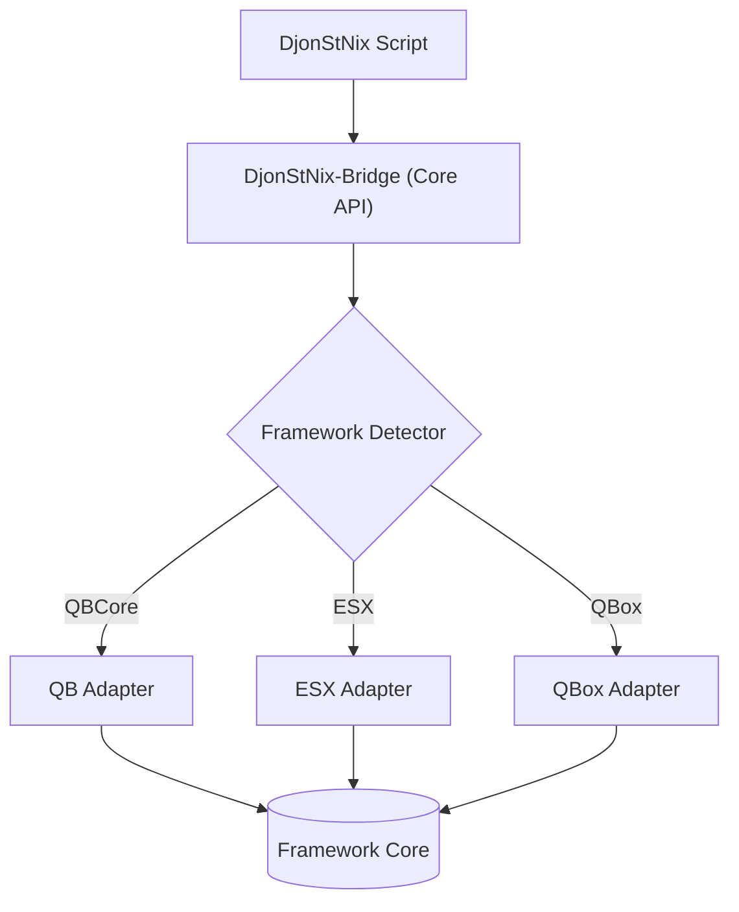

<!-- ==============================================================================
👑 DJONSTNIX BRANDING
==============================================================================
DEVELOPED BY: DjonStNix (DjonLuc)
GITHUB: https://github.com/Djonluc
DISCORD: https://discord.gg/s7GPUHWrS7
YOUTUBE: https://www.youtube.com/@Djonluc
EMAIL: djonstnix@gmail.com
LICENSE: MIT License (c) 2026 DjonStNix (DjonLuc)
============================================================================== -->

# 🌉 DjonStNix-Bridge

### Framework Abstraction Layer for the DjonStNix Ecosystem

**DjonStNix-Bridge** is the critical foundation of the DjonStNix ecosystem. It acts as a universal abstraction layer that translates native framework calls (QBCore, ESX, QBox) into a unified API. This allows every script in the ecosystem to run on any major framework without modification.

---

## 📖 Overview

The Bridge exists to solve the problem of framework fragmentation in FiveM development. Instead of writing separate logic for QBCore and ESX, developers use the Bridge's `Core` object to handle player data, money, inventory, and security. It serves as the single point of failure and success for the entire DjonStNix suite.

---

## 🧠 Architecture

The Bridge utilizes an "Adapter" pattern. It detects the running framework at startup and swaps out the underlying logic for its internal modules while maintaining a static public API.



---

## ✨ Features

- ⚙️ **Framework Agnostic:** Seamlessly supports QBCore, ESX, and QBox with zero configuration.
- 🛡️ **Atomic Security:** Integrated `SecureHandler` for rate-limited, source-validated server events.
- 📡 **Global EventBus:** Unified Pub/Sub system for inter-script communication across the ecosystem.
- 📊 **Core Validation:** Real-time data sanitization and type checking for all bridge inputs.
- 📜 **Structured Logging:** Centralized error reporting and transaction auditing via `Core.Log`.
- 🧬 **Universal Metadata:** Standardized access to player and vehicle metadata regardless of inventory system.

---

## 🔗 Recommended Integrations

This script is the **required foundation** for all other DjonStNix resources.

| Resource                                                                                   | Purpose                                                  |
| :----------------------------------------------------------------------------------------- | :------------------------------------------------------- |
| **[DjonStNix-Banking](https://github.com/Djonluc/DjonStNix-Banking)**                      | Provides the monetary backbone for the Bridge.           |
| **[DjonStNix-Government](file:///c:/fivem/Files/resources/[addons]/DjonStNix-Government)** | Manages central identity and civic licensing.            |
| **[DjonStNix-AssetRegistry](https://github.com/Djonluc/DjonStNix-AssetRegistry)**          | Integrates with Bridge metadata for persistent tracking. |

---

## 📦 Dependencies

- **Required:** `oxmysql` (Database connectivity)
- **Optional:** `ox_lib` (Enhanced UI notifications and progress bars)

---

## 📥 Installation

1.  Place the `DjonStNix-Bridge` folder inside your `resources/[addons]/` or `resources/[djonstnix]/` directory.
2.  Open your `server.cfg` and ensure it is started **before** any other DjonStNix modules.
3.  Configure your framework and security settings in `config.lua`.
4.  Restart your server or `ensure DjonStNix-Bridge`.

#### 📝 server.cfg Snippet

```cfg
# DjonStNix Core Foundation
ensure oxmysql
ensure DjonStNix-Bridge
```

---

## ⚙️ Configuration

Located in `config.lua`:

```lua
Config.Framework = "auto" -- auto, qb, esx, qbox, standalone
Config.Security = {
    RateLimit = true,
    MaxTriggersPerSecond = 5, -- Protects against spam/executors
    AuditLogs = true          -- Logs security violations to console/file
}
```

---

## 🗄️ Database Setup

This resource requires a database table for advanced auditing and security logging.

### Installation

Open your database manager (HeidiSQL, phpMyAdmin, etc.) and run the SQL file located at:
`sql/schema.sql`

This will create the `djonstnix_audit_logs` table used for long-term security monitoring.

---

## 💻 Commands

| Command        | Description                                               | Permission |
| :------------- | :-------------------------------------------------------- | :--------- |
| `/dsn-test`    | Runs a full diagnostic loop of the Bridge API             | Admin      |
| `/dsn-refresh` | Hot-reloads the player cache and framework detection      | Admin      |
| `/dsn-version` | Displays version info for all running DjonStNix resources | Admin      |

---

## 🔌 Exports

The Bridge exposes a single primary export to retrieve the Core object:

```lua
local Core = exports['DjonStNix-Bridge']:GetCore()
```

### Key Core Functions:

- `Core.Player.GetIdentifier(source)`: Returns the unique CID/License.
- `Core.Money.AddMoney(source, type, amount, reason)`: Universal money adding.
- `Core.Security.SecureServerEvent(name, cb)`: Registers a protected network event.

---

## 📡 Events

| Event                                  | Direction | Description                                          |
| :------------------------------------- | :-------- | :--------------------------------------------------- |
| `DjonStNix-Bridge:server:PlayerLoaded` | Server    | Triggered when the Bridge has fully mapped a player. |
| `DjonStNix-Bridge:client:Notify`       | Client    | Standardized notification event.                     |

---

## 🧪 Testing / Debug Tools

Use the built-in **UTF (Universal Testing Framework)** to verify your installation:

1.  Run `/dsn-test` in the server console or in-game (as admin).
2.  The Bridge will check:
    - Framework Connectivity
    - Database Connectivity (via oxmysql)
    - Export Health
    - EventBus Latency

---

## 🛠 Troubleshooting

- **"Export 'GetCore' not found"**: Ensure `DjonStNix-Bridge` is started **above** the script calling it in `server.cfg`.
- **Framework Mismatch**: If auto-detection fails, set `Config.Framework` manually to `'qb'`, `'esx'`, or `'qbox'`.
- **Permission Denied**: Check that your citizen ID is correctly added to the `admins` table or group in your framework.

---

## 🔐 Permissions & Security

- **Rate Limiting**: Every `SecureServerEvent` is automatically throttled to prevent script executor abuse.
- **Source Validation**: The Bridge verifies that the player triggering an event is the same player the data belongs to.
- **Admin Gating**: Commands are restricted using the Bridge's internal permission resolver.

---

## 👤 Author

**DjonLuc**  
Founder of the DjonStNix Ecosystem

[GitHub](https://github.com/Djonluc) | [Discord](https://discord.gg/s7GPUHWrS7)

---

## 📜 License

MIT License © 2026 **DjonStNix Ecosystem**. All rights reserved.
